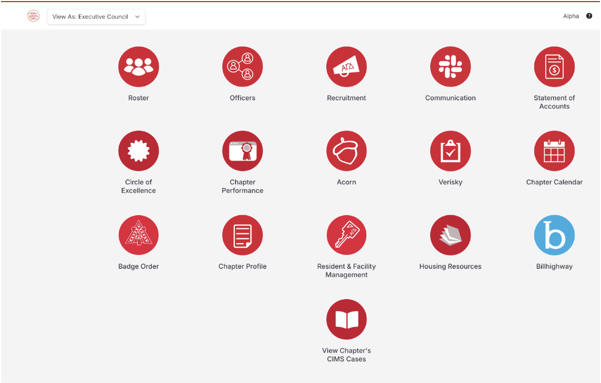

### Shared google drive:

where you want to make and store all excuse forms, rosters, minutes, agendas, etc. 

### Emails:

**Username:** [agdalphavpa1\@gmail.com](mailto:agdalphavpa1@gmail.com)

#### Director of Communications Email:

**Username:** agdalphacommunications\@gmail.com 

The recovery email for this is [agdalphavpa1\@gmail.com](mailto:agdalphavpa1@gmail.com) just in case you get locked out

### Canva:

this is key for the [Newsletter](Butterfield_Bulletin.qmd), there are also helpful tools for making free QR codes, etc. 

### [MyAlphaGam:](https://myalphagam.org/)

Log in using your normal username/password

You should automatically be prompted to this page: 

If not, then click the “Alpha” in the top right corner next to your name, use the drop down tab on the top left corner to click “View As: Executive Council”

#### Use MyAlphaGam for: 

-   Viewing, exporting, and updating the roster

-   Getting to Acorn: the resource area with all the Admin materials you’ll need from IHQ

-   Viewing and approving CIMS cases 

### Advisor

Look on the transition google doc for your advisor's name and information!

### Acorn and Specific Resources

-   Administration Team Handbook

-   CIMS Manual

-   Alpha Chapter Bylaws

-   [Other Links](Links.qmd)

